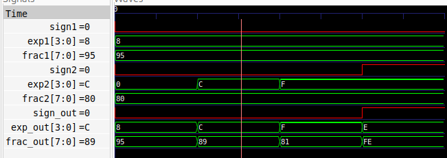
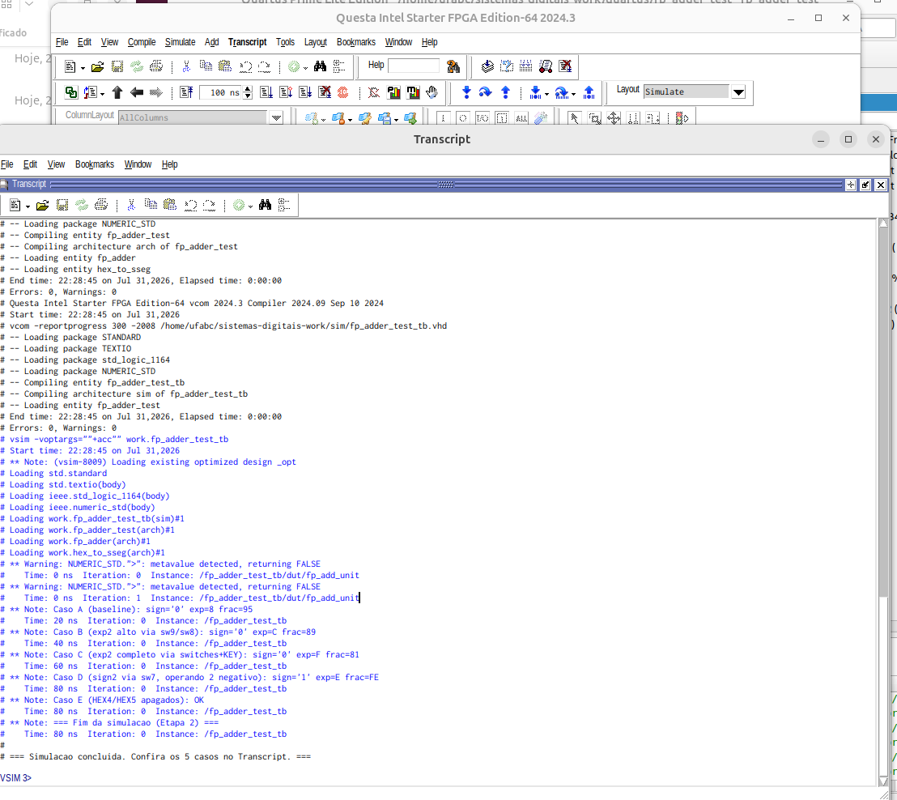
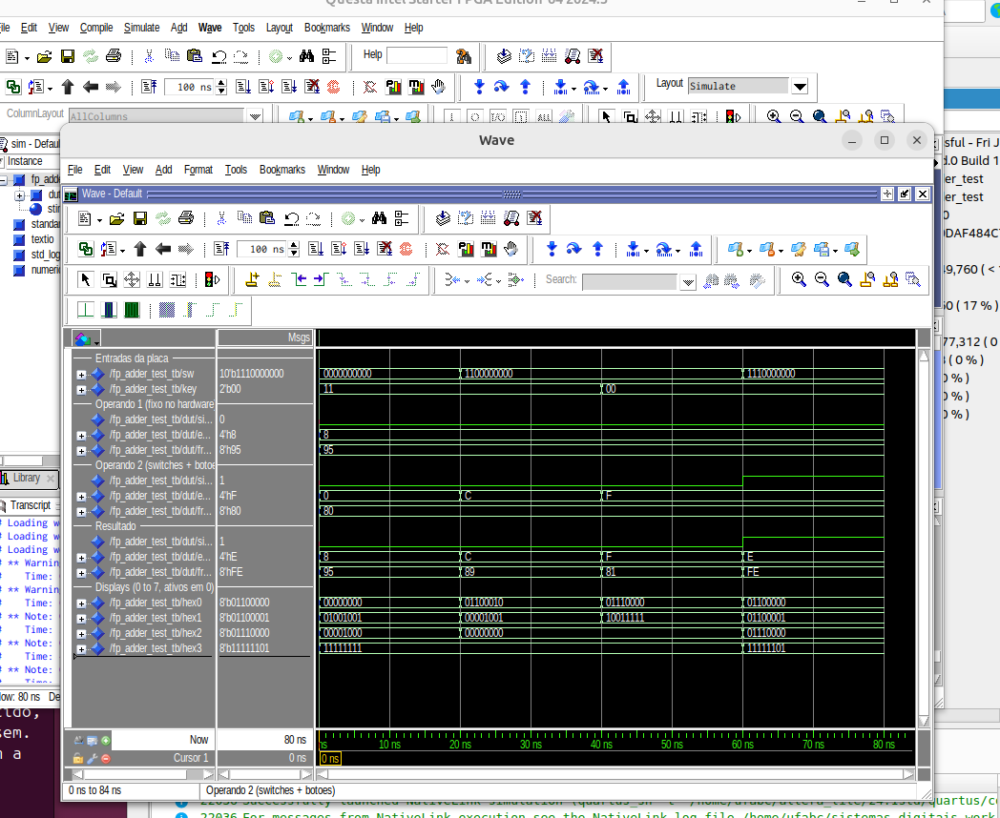
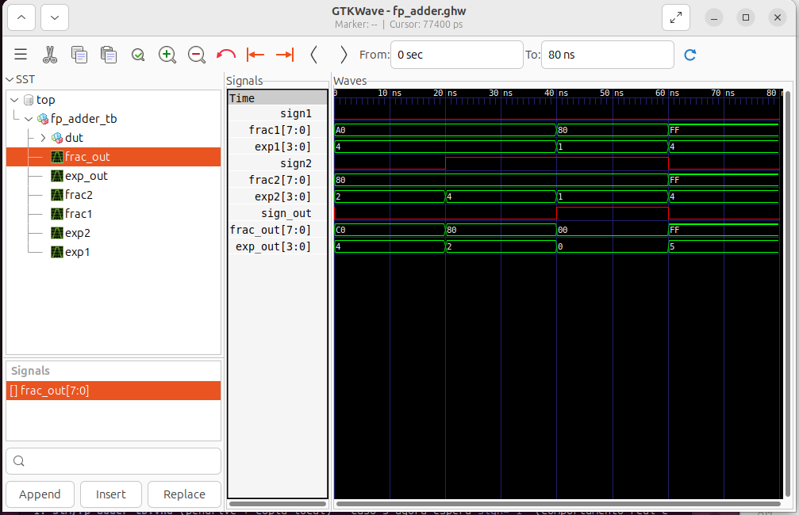
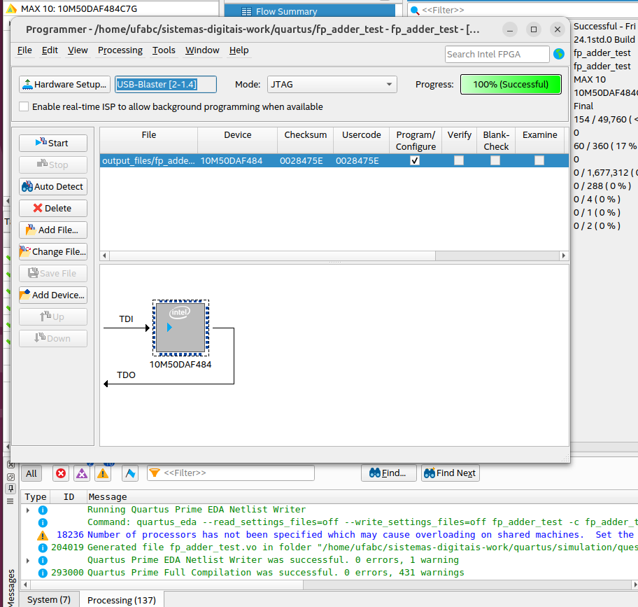
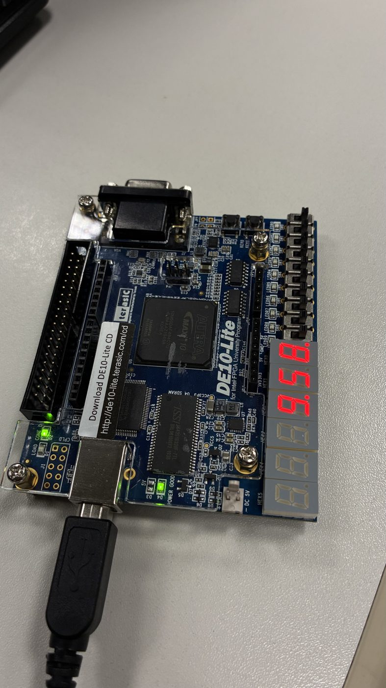
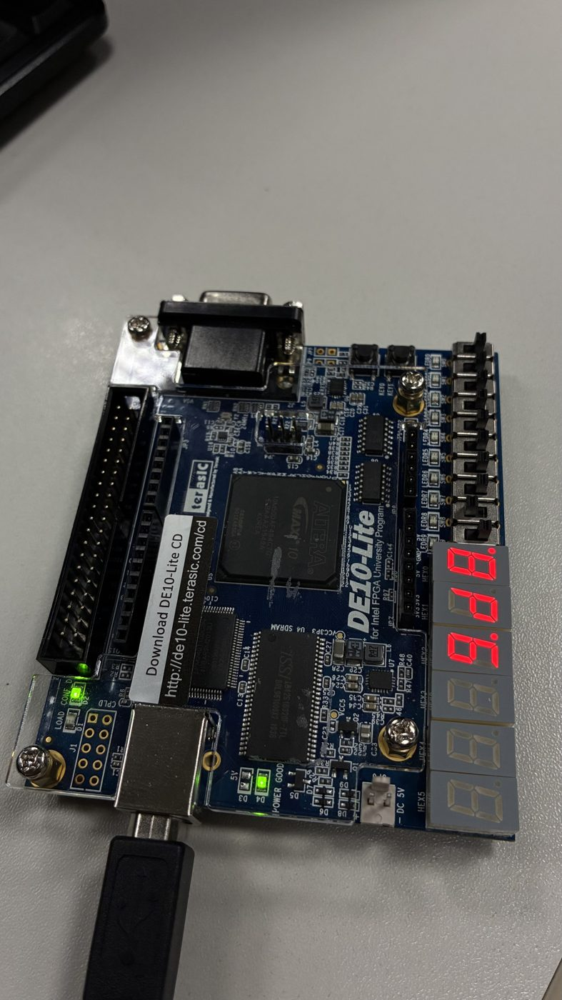
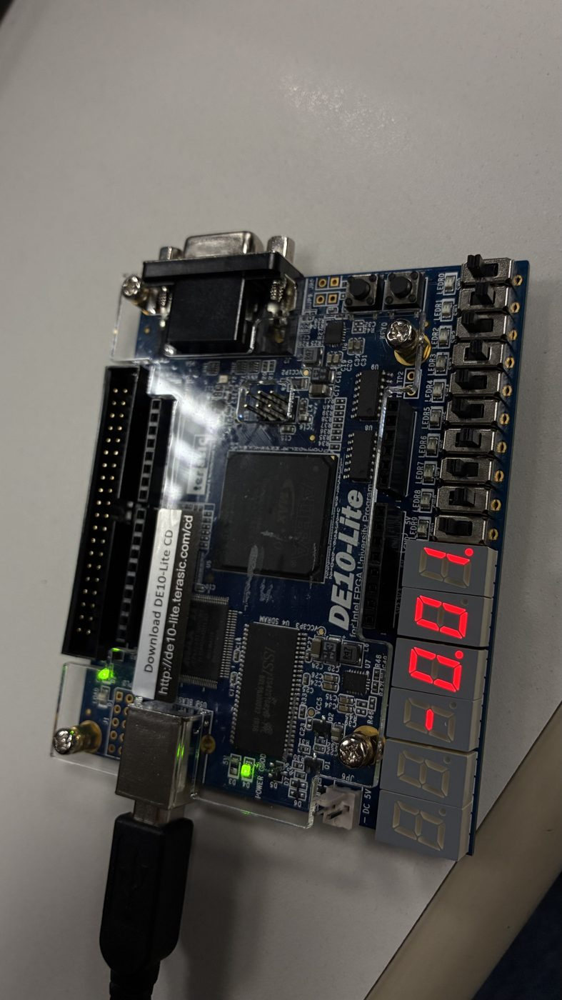
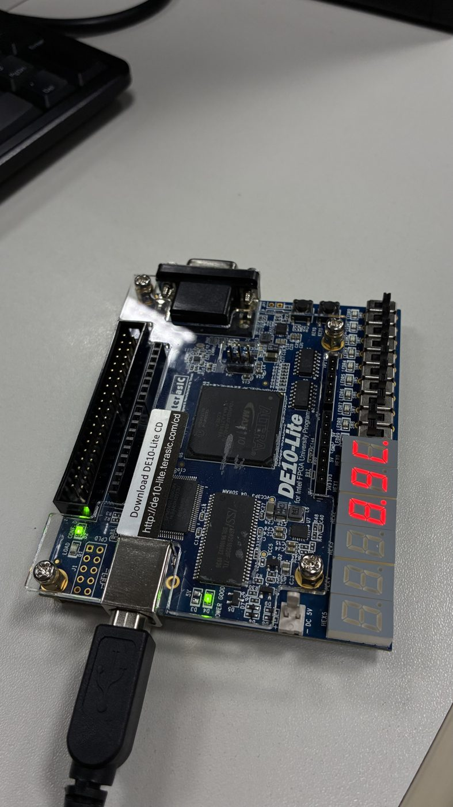
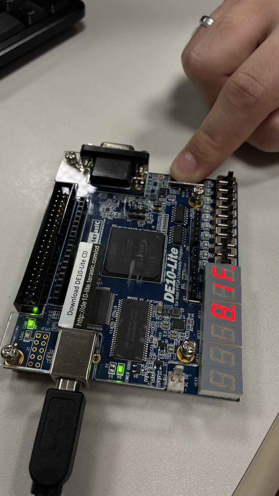

# Tutorial: Implementação de Somador Ponto Flutuante na DE10-Lite

**Autores:** Leticia Martins Bandeira Pascale, Renan Henrique Ferreira Monteiro, Pedro Henrique Fernandes Casa Grandi

**Disciplina:** Sistemas Digitais (MCTA024), Q2.2026

**Professora:** Victoria Alejandra Herrera

**Data:** 07/08/2026

---

> **Como este repositório está organizado**
> ```
> ├── src/                VHDL de projeto (fp_adder, fp_adder_test)
> ├── sim/                Testbench + script de simulação (GHDL/GTKWave)
> ├── quartus/            Projeto Intel Quartus (Etapa 3)
> ├── docs/               PDFs de referência do projeto
> ├── imagens/            Prints de ondas e da placa para o relatório
> └── ia-log/             Diário de bordo do uso de IA (auditoria)
> ```

---

## Como reproduzir do zero

Estes são todos os passos para refazer o projeto a partir de uma máquina limpa.
Uma pessoa sem contato prévio com o projeto consegue chegar ao mesmo resultado
seguindo só o que está abaixo.

**1. Clonar o repositório**
```bash
git clone https://github.com/LeticiaMartins/somador-ponto-flutuante-de10-lite.git
cd somador-ponto-flutuante-de10-lite
```

**2. Simulação (Etapas 1 e 2), precisa de GHDL + GTKWave**
```bash
sudo apt update && sudo apt install -y ghdl gtkwave   # Ubuntu/Debian
cd sim
./run_sim.sh                 # Etapa 1: 4 casos do somador (fp_adder)
./run_sim_etapa2.sh          # Etapa 2: circuito completo da placa (fp_adder_test)
./run_sim_equivalencia.sh    # prova de equivalência livro × DE10-Lite (4096 casos)
gtkwave fp_adder.ghw         # abrir as ondas da Etapa 1 (ou fp_adder_test.ghw)
```

**3. Síntese e gravação (Etapa 3), precisa do Intel Quartus Prime + Questa**
1. Abrir `quartus/fp_adder_test.qpf` no Quartus.
2. **Assignments → Import Assignments** e escolher `docs/DE10_LITE.qsf` (pinagem
   oficial da placa).
3. **Processing → Start Compilation** (deve terminar com **0 erros**).
4. Conectar a DE10-Lite pelo USB-Blaster e **Tools → Programmer → Start** para
   gravar o `.sof`.
5. Simulação no Questa: **Tools → Run Simulation Tool → RTL Simulation** e, no
   console `Questa>`, rodar `do <caminho-do-projeto>/sim/run_questa.do`.

**4. Testar na placa.** Use os estímulos da tabela "Funcionamento na Placa"
(Etapa 3): cada linha diz quais `SW`/`KEY` acionar e o que deve aparecer nos
displays.

> Se os scripts `.sh` não tiverem permissão de execução, rode antes:
> `chmod +x sim/*.sh`.

---
*Etapa 1*
## 1. Objetivo do Projeto
Este projeto adapta o somador de ponto flutuante simplificado (13 bits) do
livro-texto (*Pong P. Chu, FPGA Prototyping by VHDL Examples*) para a placa
Terasic **DE10-Lite (FPGA Intel MAX 10)**. O objetivo é demonstrar a síntese
lógica e a simulação de hardware usando VHDL.

**Formato de ponto flutuante (13 bits):**

| Campo | Bits | Descrição |
|---|---|---|
| `sign` (s) | 1 | sinal (1 = negativo) |
| `exp` (e) | 4 | expoente (sem sinal) |
| `frac` (f) | 8 | significando / fração (sem sinal) |

O valor representado é **(-1)ˢ × 0.f × 2ᵉ**. A representação é sempre
*normalizada* (MSB da fração = 1) ou *zero*.

## 2. Descrição gráfica do funcionamento do sistema

O somador processa a soma em **4 estágios** encadeados (combinacionais):

```
 entradas                                                         saída
 (s1,e1,f1)   ┌────────┐   ┌──────────┐   ┌──────────┐   ┌────────────┐
 (s2,e2,f2)──▶│ 1.      │──▶│ 2.        │─▶│ 3.        │─▶│ 4.          │──▶ (s,e,f)
              │ Ordenar │   │ Alinhar   │  │ Somar/    │  │ Normalizar  │
              │ (b/s)   │   │ (shift dir)│  │ Subtrair  │  │ (shift esq) │
              └────────┘   └──────────┘   └──────────┘   └────────────┘
```

1. **Ordenar (sort):** coloca o número de maior magnitude em cima (*big*) e o
   menor embaixo (*small*). Compara `exp&frac` dos dois operandos.
2. **Alinhar (align):** desloca a fração do menor número à **direita** por
   `expb - exps`, igualando os expoentes.
3. **Somar/Subtrair:** se os sinais são iguais, soma; se diferentes, subtrai.
   Usa 1 bit extra para o *carry-out*.
4. **Normalizar:** três casos,
   - *carry-out* (soma estourou): desloca à direita, `exp+1`;
   - *zeros à esquerda* (subtração): desloca à esquerda e conta os zeros;
   - *pequeno demais*: resultado vira **zero**.

**Interface do circuito (entradas/saídas do VHDL):**

| Porta | Direção | Largura | Descrição |
|---|---|---|---|
| `sign1, sign2` | in | 1 | sinais dos operandos |
| `exp1, exp2` | in | 4 | expoentes |
| `frac1, frac2` | in | 8 | frações |
| `sign_out` | out | 1 | sinal do resultado |
| `exp_out` | out | 4 | expoente do resultado |
| `frac_out` | out | 8 | fração do resultado |

*Etapa 2*
## 3. Adaptações de Hardware (DE10-Lite)

A placa do livro (Nexys/Basys, Xilinx) tem 8 switches, 4 botões e 4 displays
de 7 segmentos. A DE10-Lite tem **10 switches, 2 botões (KEY) e 6 displays
(HEX0-HEX5)**, larguras diferentes em quase todo I/O usado pelo circuito de
teste (`fp_adder_test.vhd`, Listing 3.20).

**O que mudamos no VHDL original:**
* **`exp2` (4 bits):** no livro vinha inteiro dos 4 botões (`btn(3 downto 0)`).
  A DE10-Lite só tem 2 botões físicos, então passamos a montar `exp2` como
  `sw(9) & sw(8) & (not key(1)) & (not key(0))`, os **2 switches extras** que a
  DE10-Lite tem a mais (10 vs 8 do livro) cobrem exatamente os 2 bits que os
  botões que faltam não conseguem mais fornecer. Usa 100% dos switches e
  botões disponíveis, sem tirar capacidade de teste do circuito original.
* **`sw`:** largura ampliada de 8 para 10 bits (`sw(9 downto 0)`).
* **`btn` → `key`:** renomeado e reduzido de 4 para 2 bits, para bater com
  os nomes reais dos botões da DE10-Lite (`KEY0`/`KEY1`).
* **`sign1, exp1, frac1`** (operando fixo) e **`sign2, frac2`** (via
  `sw(7 downto 0)`) **não mudaram**, mesma lógica do livro.
* **Displays, a maior mudança estrutural.** O livro usa *multiplexação
  temporal* (componente `disp_mux`, Listing 4.13): nas placas Xilinx os 4
  displays compartilham **um único barramento de 8 segmentos**, e o vetor
  `an` seleciona qual display está aceso a cada instante, varrendo os 4 a
  ~800 Hz. Isso existe para economizar pinos do FPGA.
  A DE10-Lite **não tem esse arranjo**: os 6 displays (`HEX0`–`HEX5`) são
  ligados diretamente ao FPGA, cada um com seus próprios pinos. Não existe
  barramento compartilhado nem sinal de anodo, a saída `an` do livro
  não teria onde ser ligada nesta placa. Portanto **removemos o
  `disp_mux`** e ligamos cada decodificador ao seu display. O resultado é
  mais simples que o original, e tem um efeito colateral relevante: o
  circuito perde sua única parte sequencial e o `clk` deixa de ser
  necessário, **o projeto inteiro passa a ser combinacional puro**.
* **Ordem dos bits do display.** O livro declara `sseg(7 downto 0)` com
  `sseg(6)` = segmento *a*, `sseg(0)` = *g* e `sseg(7)` = ponto decimal; a
  DE10-Lite usa a ordem **oposta**, `HEX0(0)` = *a* … `HEX0(6)` = *g*,
  `HEX0(7)` = ponto decimal (roteiro `docs/MCTA024_Lab3_2026-2a.pdf`, seção
  "Seven Segment Display", a professora cita essa inversão explicitamente
  como fonte de erro). Ambos são ativos em `'0'`. Como em VHDL a atribuição
  entre vetores é **posicional** (elemento mais à esquerda para elemento
  mais à esquerda), `HEX0 <= led0(6 downto 0) & led0(7);` já faz a conversão
  correta, parece cópia bit a bit, mas não é: é a tradução entre as duas
  convenções, com o ponto decimal recolocado no fim.
* **Largura dos displays: 8 bits, não 7.** O texto do roteiro mostra
  `HEX0 : out std_logic_vector(0 to 6)`, mas o arquivo de pinos oficial
  ([`docs/DE10_LITE.qsf`](docs/DE10_LITE.qsf), fornecido pela professora)
  atribui **48 pinos de display**, 6 × 8 bits, incluindo o ponto decimal
  (`PIN_D15 -to HEX0[7]`). Declaramos os `HEX` com 8 bits para casar com o
  arquivo dela e aproveitar o ponto decimal, que o `hex_to_sseg` do livro já
  produz e que marca visualmente a separação entre os campos do resultado.
* **Nomes das portas em maiúscula** (`SW`, `KEY`, `HEX0`…) para casar
  literalmente com `docs/DE10_LITE.qsf`. VHDL é *case-insensitive*, então
  isso não muda nada na simulação, é só para não restar dúvida no Quartus.
* **Polaridade dos botões.** Os `KEY` da DE10-Lite são **ativos em `'0'`**
  (solto = `'1'`), ao contrário dos `btn` ativos em `'1'` da placa do
  livro. Aplicamos `not` aos dois bits de `key` em `exp2`, preservando a
  semântica original (solto contribui `0`, pressionado contribui `1`).
  Confirmado por `docs/DE10_LITE.qsf`, que declara os `KEY` com padrão de
  I/O **"3.3 V Schmitt Trigger"**, botão com tratamento de repique em
  hardware, ativo em nível baixo. Isso encerra a pendência que estava
  registrada no `ia-log` da sessão 04.
* **`HEX4`/`HEX5`:** não são usados pelo circuito, mas são declarados e
  apagados explicitamente, pino de display sem atribuição fica solto e
  acende segmentos aleatórios na placa.
* A versão original (Listing 3.20, sem nenhuma alteração) foi preservada
  como cópia física em
  [`src/fp_adder_test_etapa1_livro.vhd`](src/fp_adder_test_etapa1_livro.vhd)
  para comparação direta com a versão adaptada em
  [`src/fp_adder_test.vhd`](src/fp_adder_test.vhd).
* Dois componentes que o `fp_adder_test` usa (`hex_to_sseg` e `disp_mux`) não
  estavam nos PDFs do projeto, foram localizados e transcritos do
  livro-texto completo (Listings 3.12 e 4.13); ver
  [`ia-log/2026-07-24-sessao-03-etapa2-componentes.md`](ia-log/2026-07-24-sessao-03-etapa2-componentes.md).

**Trecho adaptado, lado a lado.** Todas as mudanças de código se concentram nas
portas da entidade e em **uma única linha de lógica** (`exp2`). O resto do
`fp_adder_test` é idêntico ao livro.

Original (Listing 3.20, `src/fp_adder_test_etapa1_livro.vhd`):

```vhdl
sw   : in  std_logic_vector(7 downto 0);   -- 8 switches
btn  : in  std_logic_vector(3 downto 0);   -- 4 botões
...
sign2 <= sw(7);
exp2  <= btn;                              -- expoente do op.2 vem dos 4 botões
frac2 <= '1' & sw(6 downto 0);
```

Adaptado para a DE10-Lite (`src/fp_adder_test.vhd`):

```vhdl
SW   : in  std_logic_vector(9 downto 0);   -- 10 switches
KEY  : in  std_logic_vector(1 downto 0);   -- 2 botões (ativos em '0')
...
sign2 <= sw(7);
exp2  <= sw(9) & sw(8) & (not key(1)) & (not key(0));
--       \___ 2 switches extras ___/   \___ 2 KEY, polaridade invertida ___/
frac2 <= '1' & sw(6 downto 0);
```

As linhas de `sign1/exp1/frac1`, `sign2` e `frac2` permanecem **iguais**: a
adaptação é cirúrgica e é exatamente isso que a prova de equivalência (adiante)
confirma numericamente.

**Descrição gráfica do sistema**
* Sem mudança na estrutura dos 4 estágios do somador (item 2), a adaptação
  desta etapa é só na "casca" (`fp_adder_test`) que conecta switches/botões/
  displays ao `fp_adder`, que continua inalterado.

### Simulação (Etapa 2, GHDL)

Rodamos `sim/run_sim_etapa2.sh`, que instancia o `fp_adder_test` já
adaptado e observa `sign_out`/`exp_out`/`frac_out`, sinais *internos* do
wrapper, via *external names* (VHDL-2008). Assim conferimos o resultado
numérico sem depender da decodificação de 7 segmentos, que fica para a
Etapa 3 na placa.



Nas ondas acima, `sign1`, `exp1` e `frac1` são retas do início ao fim: é a
evidência visual de que o operando 1 é fixo no hardware (ver
"Por que o operando 1 é fixo", na Etapa 3). As únicas entradas que variam são
`exp2` e `sign2`, justamente as que a adaptação para a DE10-Lite reposicionou.

| Caso | O que valida | Estímulo | Resultado (`sign`, `exp`, `frac`) | | Evidência |
|---|---|---|---|---|---|
| A | baseline; operando 2 pequeno demais é absorvido | `sw=0`, botões soltos | `0`, `8`, `95` | ✅ | [caso-a](imagens/teste-etapa-2-caso-a.png) |
| B | `exp2` pelos 2 switches extras (`sw9`,`sw8`) | `sw9=sw8=1` | `0`, `C`, `89` | ✅ | [caso-b](imagens/teste-etapa-2-caso-b.png) |
| C | `exp2` completado pelos 2 `KEY` (valida a inversão de polaridade) | + ambos `KEY` pressionados | `0`, `F`, `81` | ✅ | [caso-c](imagens/teste-etapa-2-caso-c.png) |
| D | `sign2` via `sw7`; exercita subtração + normalização | + `sw7=1` | `1`, `E`, `FE` | ✅ | [caso-d](imagens/teste-etapa-2-caso-d.png) |
| E | `HEX4`/`HEX5` apagados |, | `1111111` | ✅ | (verificado por `assert`) |

Os valores foram conferidos manualmente contra o algoritmo, não só pelos
`assert`. O Caso D é o mais completo: op2 = −0.10000000×2¹⁵ é o de maior
magnitude; op1 é alinhado deslocando 7 à direita (`00000001`); os sinais
diferem, então subtrai (`01111111`); a normalização desloca 1 à esquerda
(`11111110`) e decrementa o expoente (15−1 = 14 = `E`).

> A simulação termina sozinha em 80 ns: sem o `disp_mux`, o circuito é
> combinacional e não há gerador de clock produzindo eventos indefinidamente.

### Simulação no Questa (Intel Starter FPGA Edition)

Além do GHDL, a mesma simulação foi executada no **Questa**, que acompanha o
Quartus, via `Tools → Run Simulation Tool → RTL Simulation`. Script:
[`sim/run_questa.do`](sim/run_questa.do), no console do Questa:

```tcl
do <caminho-do-projeto>/sim/run_questa.do
```

O script existe porque o Quartus, ao abrir o Questa, compila apenas os
arquivos **de projeto** (`src/`): os testbenches não fazem parte do projeto
Quartus, já que não vão para a placa. Ele compila os fontes e o testbench com
`vcom -2008` (obrigatório, o testbench usa *external names*), elabora com
`-voptargs="+acc"` (sem isso o otimizador elimina os sinais internos e os
*external names* deixam de resolver), monta as ondas e roda.

**Resultado: os 5 casos passam, com valores idênticos aos do GHDL.** Ter dois
simuladores independentes concordando bit a bit é uma verificação a mais: um
erro de transcrição do testbench ou uma particularidade de um simulador
apareceria como divergência entre eles.

Saída completa arquivada em
[`sim/resultado-questa.txt`](sim/resultado-questa.txt); as quatro compilações
(`vcom`) reportam `Errors: 0, Warnings: 0`, e a simulação:

```
** Note: Caso A (baseline): sign='0' exp=8 frac=95
   Time: 20 ns  Iteration: 0  Instance: /fp_adder_test_tb
** Note: Caso B (exp2 alto via sw9/sw8): sign='0' exp=C frac=89
   Time: 40 ns  Iteration: 0  Instance: /fp_adder_test_tb
** Note: Caso C (exp2 completo via switches+KEY): sign='0' exp=F frac=81
   Time: 60 ns  Iteration: 0  Instance: /fp_adder_test_tb
** Note: Caso D (sign2 via sw7, operando 2 negativo): sign='1' exp=E frac=FE
   Time: 80 ns  Iteration: 0  Instance: /fp_adder_test_tb
** Note: Caso E (HEX4/HEX5 apagados): OK
** Note: === Fim da simulacao (Etapa 2) ===
```





> Os dois únicos warnings da simulação são
> `NUMERIC_STD.">": metavalue detected` no instante 0, antes de os estímulos
> assentarem, o comparador do 1º estágio avaliando sinais ainda em `'U'`. São
> exatamente os mesmos que o GHDL reporta, e somem já no primeiro delta.
> Nenhum indica problema no circuito.

### Prova de equivalência, a adaptação mudou o resultado?

Os 5 casos acima validam o *roteamento* novo, mas não respondem diretamente à
pergunta que interessa: **adaptar para a DE10-Lite alterou o que o circuito
calcula?** Para responder isso construímos
[`sim/fp_adder_equiv_tb.vhd`](sim/fp_adder_equiv_tb.vhd), que instancia as
duas versões **lado a lado**,
[`fp_adder_test_etapa1_livro`](src/fp_adder_test_etapa1_livro.vhd) (Listing
3.20 congelado) e [`fp_adder_test`](src/fp_adder_test.vhd) (adaptado), e
compara `sign_out`/`exp_out`/`frac_out` das duas a cada combinação de entrada.

A varredura é **exaustiva** sobre tudo que o circuito de teste consegue
variar: 256 valores de `sw(7..0)` × 16 valores de `exp2` = **4096
combinações**.

```
=== RESULTADO: EQUIVALENTES. Nenhuma divergencia em 4096 combinacoes. ===
```

Como os estímulos de `exp2` chegam por caminhos físicos diferentes nas duas
versões (`btn` ativo em `'1'` no livro, `sw(9)`/`sw(8)` + `KEY` ativo em `'0'`
na DE10-Lite), esse resultado também valida a inversão de polaridade dos
botões: se o `not` estivesse errado, as duas versões divergiriam.

> **Por que não repetimos os 4 casos da Etapa 1 aqui?** Porque eles são
> **inalcançáveis** através do circuito de teste, e isso vale igualmente
> para a versão do livro. O Listing 3.20 fixa o operando 1 no hardware
> (`sign1 <= '0'; exp1 <= "1000"; frac1 <= '1' & sw(1) & sw(0) & "10101";`):
> o expoente é sempre 8 e só 2 bits da fração vêm dos switches. Os casos da
> Etapa 1 usam `exp1 = 0100`/`0001` e frações como `10100000`, que nenhum
> ajuste de switches produz. É uma limitação do circuito de teste do livro,
> não da nossa adaptação, as três linhas são idênticas nas duas versões.
> A cobertura da matemática do somador continua sendo feita pelo
> [`sim/fp_adder_tb.vhd`](sim/fp_adder_tb.vhd) da Etapa 1, que aciona o
> `fp_adder` diretamente, sem passar pelo wrapper; reexecutado nesta etapa,
> os 4 casos continuam passando (o `fp_adder.vhd` não foi tocado desde a
> Etapa 1).

## 4. Evidências de Validação

### Simulação (Etapa 1, GHDL + GTKWave)

Rodamos `sim/run_sim.sh` (GHDL: análise → elaboração → execução, gerando
`fp_adder.ghw`) e inspecionamos os 4 casos do testbench (`sim/fp_adder_tb.vhd`)
no GTKWave, conforme o roteiro do Lab 1 fornecido pela professora.



_Casos simulados e resultado observado:_

| Caso | Descrição | Entradas (A, B) | Saída esperada (s, e, f) | Resultado | Evidência |
|---|---|---|---|---|---|
| 1 | soma sem carry | +0.10100000×2⁴, +0.10000000×2² | 0, 0100, 11000000 | ✅ OK | [teste-etapa-1-caso-1.png](imagens/teste-etapa-1-caso-1.png) |
| 2 | subtração, zeros à esquerda → desloca à esquerda | +0.10100000×2⁴, −0.10000000×2⁴ | 0, 0010, 10000000 | ✅ OK | [teste-etapa-1-caso-2.png](imagens/teste-etapa-1-caso-2.png) |
| 3 | subtração pequena demais → resultado = 0 | +0.10000000×2¹, −0.10000000×2¹ | **1**, 0000, 00000000 | ✅ OK (após correção, ver análise abaixo) | [teste-etapa-1-caso-3.png](imagens/teste-etapa-1-caso-3.png) |
| 4 | soma com carry-out → desloca à direita, `exp+1` | +0.11111111×2⁴, +0.11111111×2⁴ | 0, 0101, 11111111 | ✅ OK | [teste-etapa-1-caso-4.png](imagens/teste-etapa-1-caso-4.png) |

**Achado de validação, sinal do zero não é canônico:** na primeira rodada, o
Caso 3 falhou porque o testbench esperava `sign=0`. Investigando o waveform e
comparando linha a linha com o **Listing 3.19 original do livro**
(`docs/codigo-fonte-livro-pong-chu.pdf`), confirmamos que:

- `sign_out <= signb;` (linha 107 do livro) nunca é forçado a `0` quando o
  resultado numérico é zero, só `exp`/`frac` são zerados. Isso é assim **no
  livro original**, não é um erro da nossa transcrição.
- Como no Caso 3 as magnitudes de entrada são iguais (`exp&frac` empatados), o
  1º estágio (comparação `>` estrita) sempre resolve o empate escolhendo o
  operando 2 como "big", por isso `sign_out` sai `1`.
- Conclusão: o algoritmo simplificado do livro **não implementa "zero com
  sinal canônico"** (diferente do `+0` do IEEE 754). É uma limitação real e
  documentada do design original, não um bug do circuito.

O valor esperado do testbench foi corrigido para `sign=1` (ver
`sim/fp_adder_tb.vhd`, Caso 3, e o registro completo em
[`ia-log/2026-07-24-sessao-02-etapa1-simulacao.md`](ia-log/2026-07-24-sessao-02-etapa1-simulacao.md)).

**Segunda metade do mesmo achado, o expoente do zero também não é canônico.**
Ao levantar os ajustes de switches para a Etapa 3, encontramos um caso de
resultado zero que sai com `exp=1` em vez do `exp=0` observado no Caso 3 da
Etapa 1. A causa está no contador de zeros à esquerda:

```vhdl
signal leado : unsigned(2 downto 0);        -- linha 36: apenas 3 bits
...
elsif (leado > expb) then                   -- linha 108: "pequeno demais" -> zera
```

`leado` tem 3 bits e conta no máximo **7**, mas a fração tem **8** bits. Quando
a subtração dá tudo zero, existem 8 zeros à esquerda e o contador satura em 7.
A partir daí o resultado depende do expoente de entrada:

| Expoente dos operandos | `leado > expb`? | Saída |
|---|---|---|
| `expb ≤ 7` (Caso 3 da Etapa 1, `expb=1`) | sim | `exp=0`, `frac=00` |
| `expb ≥ 8` (ajuste da Etapa 3, `expb=8`) | não | `exp = expb − 7`, `frac=00` |

Numericamente é indiferente, com `frac=00` o valor é zero qualquer que seja o
expoente. Mas confirma que **o zero não tem representação única** neste
formato: `0×2⁰` e `0×2¹` são o mesmo número com códigos diferentes. É a mesma
causa de fundo do achado do sinal: o algoritmo simplificado do livro não
canoniza o zero, enquanto o IEEE 754 canoniza. Lá era o sinal, aqui é o
expoente.

### Código VHDL Final (Etapa 1)
`src/fp_adder.vhd` é uma transcrição fiel do Listing 3.19 do livro-texto, **sem
nenhuma alteração de lógica**, conferida linha a linha nesta etapa
especificamente por causa do achado acima. Os trechos adaptados para a
DE10-Lite serão destacados aqui na Etapa 2.

*Etapa 3*

### Por que o operando 1 é fixo no hardware

O circuito de teste do livro fixa o primeiro operando no código:

```vhdl
sign1 <= '0';
exp1  <= "1000";
frac1 <= '1' & sw(1) & sw(0) & "10101";
```

Isso não é simplificação preguiçosa, é aritmética de pinos. Cada operando
precisa de **12 bits ajustáveis**: `sign` (1) + `exp` (4) + `frac` (7, são 8
bits, mas o mais significativo é sempre `1`, porque o formato é normalizado).
Dois operandos exigiriam **24 entradas**; a DE10-Lite oferece **12** (10
switches + 2 botões). Não cabe. O livro dá todos os pinos ao operando 2 e
solda o operando 1.

Cada pedaço tem uma razão:

* **`exp1 = 1000` (8)**, escolhido por dois motivos. Primeiro, com expoente 8
  o valor é a própria fração lida como inteiro (`0.10010101 × 2⁸ = 149/256 ×
  256 = 149`), o que facilita conferir na bancada. Segundo, 8 fica **no meio**
  da faixa 0–15: assim `exp2` pode ser menor (operando 1 é o maior), igual, ou
  maior, dando acesso ao alinhamento nos dois sentidos. Com `exp1` em 0 ou 15,
  metade dos casos seria intestável.
* **`sign1 = '0'`**, mantendo o operando 1 sempre positivo, `sw(7)` sozinho
  decide a operação: iguais → soma, diferentes → subtração. Um switch cobre os
  dois caminhos.
* **`'1' & sw(1) & sw(0) & "10101"`**, o `'1'` é imposto pelo formato
  normalizado. `sw(1)` e `sw(0)` são um reaproveitamento esperto: são os bits
  **menos significativos** do operando 2, então mexer neles altera o operando 2
  em 1–2 unidades, mas o operando 1 em 32–64, porque lá caem em posições altas.
  O `"10101"` é enchimento arbitrário, padrão alternado, fácil de reconhecer no
  display e que evita frações redondas demais, que mascarariam erros de
  deslocamento.

| `sw1` `sw0` | operando 1 | operando 2 (com `exp2=8`) |
|---|---|---|
| `0 0` | `0x95` = 149 | 128 |
| `0 1` | `0xB5` = 181 | 129 |
| `1 0` | `0xD5` = 213 | 130 |
| `1 1` | `0xF5` = 245 | 131 |

**Mantivemos o operando 1 fixo**, igual ao livro. Removê-lo exigiria adicionar
um registrador e um botão de carga, o que traria o clock de volta (o circuito
deixaria de ser combinacional), consumiria um pino como botão, e exigiria usar
`HEX4`/`HEX5` para mostrar o valor guardado. Seria um redesenho do circuito de
teste, não uma adaptação de placa, e invalidaria a prova de equivalência da
seção anterior, que só faz sentido enquanto as duas versões são comparáveis.

### Roteiro de demonstração na placa

Mesmo com o operando 1 fixo, **os quatro comportamentos do somador são todos
alcançáveis pelos switches**. Ajustes verificados em simulação:

| Comportamento | `sw9`…`sw0` | KEYs | Resultado esperado |
|---|---|---|---|
| soma sem carry | `0100000000` | soltos | `sign=0` `exp=8` `frac=9D` |
| soma com **carry-out** | `1000000000` | soltos | `sign=0` `exp=9` `frac=8A` |
| subtração + deslocamento à esquerda | `1010000000` | soltos | `sign=0` `exp=5` `frac=A8` |
| resultado **zero** | `1010110101` | soltos | `sign=1` `exp=1` `frac=00` |

No display: `HEX0` mostra o expoente, `HEX2`/`HEX1` os dois dígitos da fração,
`HEX3` o sinal (traço central aceso = negativo).

### Síntese no Quartus

Projeto criado em `quartus/` com o dispositivo **`10M50DAF484C7G`** e
`fp_adder_test` como *top-level*. Arquivos de projeto: `fp_adder.vhd`,
`hex_to_sseg.vhd` e `fp_adder_test.vhd`, `disp_mux.vhd` ficou de fora, pela
razão explicada na Etapa 2.

A pinagem foi importada de [`docs/DE10_LITE.qsf`](docs/DE10_LITE.qsf)
(`Assignments → Import Assignments`), o arquivo oficial fornecido pela
professora na pasta Lab3, e os pinos não utilizados foram configurados como
**"As input tri-stated"** (`Device and Pin Options`), conforme a Fig. 11 do
roteiro.

**Compilação:** `0 erros`. Os warnings são atribuições do `.qsf` para
periféricos que este projeto não usa (`LEDR`, `DRAM`, `VGA`, `GSENSOR`,
`ARDUINO`…), o arquivo nomeia a placa inteira e o circuito usa uma parte
dela. **Gravação:** concluída via USB-Blaster (JTAG), `100% Successful`.



### Organização dos displays na placa

```
HEX5    HEX4    HEX3     HEX2      HEX1      HEX0
apag.   apag.   sinal    frac↑     frac↓     expoente
```

`HEX3` fica apagado quando o resultado é positivo e acende apenas o segmento
central (traço) quando é negativo.

### Funcionamento na Placa

Casos testados na DE10-Lite. Os ajustes vêm da tabela "Roteiro de demonstração
na placa" acima; os resultados esperados foram calculados em simulação antes
de ir para o hardware.

Com o bitstream gravado e todos os switches para baixo, a placa parte do estado
inicial mostrando `958` (`HEX0 = 8`, fração `95`), o operando padrão do circuito:



| # | Comportamento | Switches para cima | `HEX3` | `HEX2` `HEX1` | `HEX0` | Evidência |
|---|---|---|---|---|---|---|
| 1 | soma sem carry | `SW8` | apagado | `9` `D` | `8` | [caso-1](imagens/placa-etapa-3-caso-1.jpg) |
| 2 | soma com **carry-out** | `SW9` | apagado | `8` `A` | `9` | [caso-2](imagens/placa-etapa-3-caso-2.jpg) |
| 3 | subtração + normalização | `SW9` `SW7` | apagado | `A` `8` | `5` | [caso-3](imagens/placa-etapa-3-caso-3.jpg) |
| 4 | resultado **zero** | `SW9` `SW7` `SW5` `SW4` `SW2` `SW0` | **traço** | `0` `0` | `1` | [caso-4](imagens/placa-etapa-3-caso-4.jpg) |

As leituras nos displays confirmam os valores esperados (`HEX3` sinal · `HEX2 HEX1`
fração · `HEX0` expoente): Caso 1 → `9D8`, Caso 2 → `8A9`, Caso 3 → `A85`,
Caso 4 → `-001` (o traço em `HEX3` sinaliza o resultado negativo/zero).




**Validação da polaridade dos botões no hardware.** Com `SW9` e `SW8` para
cima e os botões soltos, `HEX0` mostra `C`; mantendo os switches e
pressionando `KEY0` e `KEY1` juntos, `HEX0` passa para `F`. Isso confirma na
placa física o que o `.qsf` indicava e o que a simulação assumia: os `KEY` são
ativos em `'0'`, e a inversão aplicada em `exp2` está correta. No display isso
aparece como `89C` (soltos) → `81F` (pressionados):




### Interpretação numérica: decimal → binário de 13 bits → decimal

Validar o circuito é mais do que "acender o display": é mostrar que dominamos a
tradução **nos dois sentidos**, do número decimal para o formato normalizado de
13 bits que entra pelos switches, e do binário exibido de volta para o decimal.
Cada valor no formato vale:

> **valor = (−1)ˢ × 0.f × 2ᵉ = (−1)ˢ × f × 2⁽ᵉ⁻⁸⁾**   (`f` de 8 bits, `0.f = f/256`)

**Ida (decimal → normalizado → 13 bits).** O operando 1 é fixo
(`sign=0`, `exp=1000`, `frac=1·sw1·sw0·10101`); o operando 2 vem dos switches
(`sign=sw7`, `exp2=sw9 sw8 0 0` com os botões soltos, `frac2=1·sw6…sw0`).
Para o Caso 1 (só `SW8` para cima):

| Operando | decimal | normalizado | binário 13 bits (`s eeee ffffffff`) |
|---|---|---|---|
| Op1 | 149 | 0.10010101 × 2⁸ | `0 1000 10010101` |
| Op2 | +8 | 0.10000000 × 2⁴ | `0 0100 10000000` |

**Volta (binário exibido → decimal).** O display mostra `9D8`, ou seja `exp=8`
e `frac=0x9D=10011101`, que vale `0.10011101 × 2⁸ = 157/256 × 256 = 157`. E de
fato **149 + 8 = 157** ✔. O caminho de volta bate com a conta decimal.

A tabela abaixo fecha esse ciclo para os quatro casos testados na placa:

| Caso | Op1 (dec) | Op2 (dec) | Conta decimal | Display | Binário do resultado (`s eeee ffffffff`) | Volta p/ decimal | Confere |
|---|---|---|---|---|---|---|---|
| 1 · soma sem carry | 149 | +8 | 149 + 8 = 157 | `9D8` | `0 1000 10011101` | 0.10011101 × 2⁸ = 157 | ✔ |
| 2 · carry-out | 149 | +128 | 149 + 128 = 277 | `8A9` | `0 1001 10001010` | 0.10001010 × 2⁹ = 276 | ✔ (¹) |
| 3 · subtração | 149 | −128 | 149 − 128 = 21 | `A85` | `0 0101 10101000` | 0.10101000 × 2⁵ = 21 | ✔ |
| 4 · resultado zero | 181 | −181 | 181 − 181 = 0 | `-001` | `1 0001 00000000` | 0 | ✔ (²) |

(¹) A soma exata é 277, mas o resultado exibido é **276**: o *carry-out* força um
deslocamento à direita e o bit menos significativo (peso 1) é truncado. É o
comportamento correto da aritmética de fração de 8 bits do formato, não um erro.

(²) `181 − 181 = 0`, mas o display mostra `-001` (sinal aceso, `exp=1`) em vez de
`+000`. É exatamente o **zero não-canônico** analisado na Seção 4: o formato
simplificado do livro não força o sinal nem o expoente do zero.

*Etapa 4*
## 5. Diário de Bordo de IA
Utilizamos o **Claude (Anthropic)** para auxiliar no entendimento do código,
na geração do testbench, na organização do repositório e na adaptação para a
DE10-Lite. O registro completo e cronológico está na pasta
[`ia-log/`](ia-log/). Abaixo, a análise crítica.

**Prompts utilizados (representativos).** Cada sessão do `ia-log/` abre com o
prompt que a iniciou; os principais foram:

> - *Sessão 01 (setup):* "Vamos planejar o desenvolvimento do trabalho de
>   Sistemas Digitais. Leia os dois PDFs, crie o repositório no GitHub com os
>   arquivos-base (ex: template do relatório), vá atualizando o relatório com o
>   que fizermos e sirva de guia."
> - *Sessão 02 (Etapa 1):* "Simular o VHDL original do somador no GHDL e conferir
>   os 4 casos do testbench contra o resultado esperado do livro."
> - *Sessão 03 (Etapa 2):* "Faltam os componentes `hex_to_sseg` e `disp_mux` que
>   o `fp_adder_test` usa. Onde estão e como adaptar o circuito de teste para os
>   switches, botões e displays da DE10-Lite?"
> - *Sessão 04 (Etapa 2, correção):* "Essa correção que fizemos no script de
>   simulação vale também para a Etapa 3 (gravação na placa)?" (foi essa pergunta
>   que destravou o erro do `disp_mux`).
> - *Sessão 05 (Etapa 4):* "Preencher os nomes do grupo e a tabela CRediT",
>   "A entrega é 07/08", "Adicionar as fotos da placa ao relatório".

**O Erro da IA (Alucinação), Etapa 1:**
> Ao criar o testbench `sim/fp_adder_tb.vhd` (sessão 1), a IA calculou os 4
> casos de teste, incluindo o Caso 3 (resultado zero), e assumiu, sem
> verificar contra o livro-texto, que o circuito canonizaria o sinal do zero
> como `0`, seguindo a convenção do IEEE 754 (`+0`/`-0`). Essa suposição
> estava errada: o formato simplificado do livro nunca define esse
> comportamento.

**A Correção Humana:**
> Rodamos a simulação (Etapa 1) e o Caso 3 falhou. Em vez de aceitar o erro
> como um problema do circuito, investigamos o waveform no GTKWave e
> comparamos `src/fp_adder.vhd` linha a linha com o Listing 3.19 original do
> livro (`docs/codigo-fonte-livro-pong-chu.pdf`), confirmando que nossa
> transcrição é fiel e que o comportamento observado (`sign_out=1`) é o
> comportamento correto e esperado do algoritmo publicado. Corrigimos o valor
> esperado no testbench (não o circuito) e documentamos o achado, ver
> [`ia-log/2026-07-24-sessao-02-etapa1-simulacao.md`](ia-log/2026-07-24-sessao-02-etapa1-simulacao.md)
> para a análise completa e as capturas de tela em `imagens/` para a evidência.

**O Erro da IA, Etapa 2:**
> Ao adaptar o circuito de teste para a DE10-Lite (sessão 03), a IA ajustou
> switches, botões e larguras de porta, mas manteve o componente `disp_mux`
> do livro sem questionar se a arquitetura de displays da DE10-Lite era a
> mesma da placa Xilinx. Ela chegou a anotar no código que "a DE10-Lite tem
> 6 displays, avaliar se todos serão usados", tratou como questão de
> *quantidade* (4 de 6) o que era uma diferença **estrutural**: o livro
> multiplexa displays no tempo para economizar pinos, a DE10-Lite liga cada
> display diretamente ao FPGA. A saída `an` do circuito simplesmente não tem
> onde ser ligada nesta placa. O erro sobreviveu porque a validação daquela
> sessão foi só de compilação, e o GHDL aceita o circuito sem reclamar, em
> simulação, `an` é um sinal como outro qualquer. O problema só apareceria na
> Etapa 3, com a placa na mão.

**A Correção Humana:**
> O grupo perguntou se uma correção feita no script de simulação valia
> também para a Etapa 3, uma pergunta sobre síntese física, não sobre
> simulação. Foi essa pergunta que levou à revisão do caminho dos displays e
> à descoberta do problema. Quando a IA propôs rodar os testes da Etapa 2
> antes de corrigir, o grupo recusou: a Etapa 2 **é** a adaptação para a
> DE10-Lite, então validar um código que não roda na placa não fecha etapa
> nenhuma. Corrigimos primeiro e testamos depois. A pinagem foi verificada
> contra o roteiro da professora (`docs/MCTA024_Lab3_2026-2a.pdf`), não
> contra a memória do modelo, e é de lá que vem a confirmação de que os
> displays são `std_logic_vector(0 to 6)`, ativos em `'0'`, com a ordem de
> bits invertida em relação ao livro. Registro completo em
> [`ia-log/2026-07-31-sessao-04-etapa2-displays-de10lite.md`](ia-log/2026-07-31-sessao-04-etapa2-displays-de10lite.md).
>
> **Lição metodológica:** "compila" e "simula" não provam que o circuito é
> sintetizável *naquela placa*. Diferenças de arquitetura de I/O são
> invisíveis no GHDL. Cada componente herdado do livro precisa ser revisado
> perguntando *por que ele existe*, não só *se ele compila*.

**Onde concordamos com a IA e o que aprendemos.** O diário acima destaca os
pontos em que corrigimos a IA, mas boa parte das sugestões nós **aceitamos por
concordar com o raciocínio**, e não sem entender:

- **Montar `exp2` com os 2 switches extras + os 2 `KEY` invertidos.** A IA propôs
  `sw(9) & sw(8) & (not key(1)) & (not key(0))`. Concordamos depois de verificar
  no `docs/DE10_LITE.qsf` que os `KEY` são ativos em `'0'`; ficou claro *por que*
  o `not` é necessário. Aprendemos a ler polaridade de I/O a partir do arquivo de
  pinos, e não por tentativa e erro na placa.
- **Remover o `disp_mux`.** A princípio parecia que estávamos "jogando código
  fora". Ao entender que a multiplexação temporal só existe para economizar pinos
  em placas que compartilham barramento, e que a DE10-Lite liga cada display
  direto ao FPGA, concordamos: o circuito ficou mais simples *e* mais correto.
  Aprendemos que herdar um componente do livro sem questionar sua razão de ser
  pode carregar uma dependência que nem existe na plataforma nova.
- **Prova de equivalência por força bruta (4096 casos).** Aceitamos a ideia de
  comparar a versão do livro com a adaptada em *todas* as entradas possíveis, em
  vez de conferir só alguns casos. Aprendemos que, quando o espaço de entrada é
  pequeno, o teste exaustivo é mais convincente do que casos escolhidos a dedo.

Em todas essas decisões o critério foi o mesmo: só adotamos a sugestão depois de
conseguir explicá-la com as nossas palavras e conferir contra a fonte oficial
(livro ou roteiro da professora). A IA acelerou o trabalho; a conferência foi
sempre nossa.

## 6. Contribuição dos participantes

O trabalho foi desenvolvido de forma **totalmente colaborativa**: os três
integrantes se reuniram presencialmente no laboratório e conduziram todas as
etapas juntos, desde o entendimento do VHDL original e a simulação, passando
pela adaptação para a DE10-Lite, até a síntese, gravação na placa e a redação
deste relatório. Por isso, seguindo a taxonomia [CRediT](https://credit.niso.org/),
os mesmos papéis são atribuídos aos três autores:

 * **Leticia Martins Bandeira Pascale**: Conceituação, Metodologia,
   Desenvolvimento de software, Validação, Análise Formal, Investigação,
   Redação (rascunho original), Redação (revisão e edição),
   Administração do projeto.
 * **Renan Henrique Ferreira Monteiro**: Conceituação, Metodologia,
   Desenvolvimento de software, Validação, Análise Formal, Investigação,
   Redação (rascunho original), Redação (revisão e edição),
   Administração do projeto.
 * **Pedro Henrique Fernandes Casa Grandi**: Conceituação, Metodologia,
   Desenvolvimento de software, Validação, Análise Formal, Investigação,
   Redação (rascunho original), Redação (revisão e edição),
   Administração do projeto.
